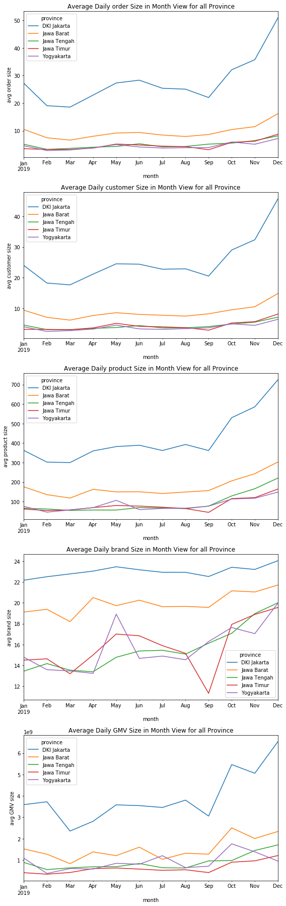

# Mini Project - Sales Performance in Each Branch Analysis

## Disclaimer

This is a mini project provided by [Academy DQLab](https://dqlab.id).

In this case, the company needs to compare the performance of each branch in various cities. Take the five (5) largest cities in Java to be analyzed in terms of order size, customer count, product count, brand count, and GMV on a monthly basis.

The dataset provided is net data on the performance of the company's branches in 2019.

## Sales Data in Each Branch
- Provided 4 csv files containing retail data for each Quarter:
     - csv (data from January - March) -> [here](https://dqlab-dataset.s3-ap-southeast-1.amazonaws.com/LO4/retail_data_from_1_until_3.csv)
     - csv (data from April - June) -> [here](https://dqlab-dataset.s3-ap-southeast-1.amazonaws.com/LO4/retail_data_from_4_until_6.csv)
     - csv (data from July - September) -> [here](https://dqlab-dataset.s3-ap-southeast-1.amazonaws.com/LO4/retail_data_from_7_until_9.csv)
     - csv (data from October - December) -> [here](https://dqlab-dataset.s3-ap-southeast-1.amazonaws.com/LO4/retail_data_from_10_until_12.csv)
- Goal: Automation for making graphs of the measurement required.

## Tasks and Steps

1. Load each data *.csv with Pandas
2. Checking and Data Transformation
    - Check data at a glance (seeing the form of data is usually the top 5 data)
    - Check the column list for all dataframes whether all the columns of the four separate dataframes are the same
    - If the same is combined.
    - Check the combined dataframe information
    - Descriptive statistics of aggregated dataframes.
3. Data Transformation
    - If there is data that is not supposed to be discarded
    - If there is a column that should be of type datetime64 change it
    - Check back dataframe information
    - Show back descriptive statistics from dataframe
4. Filter province which only includes 5 major provinces in Java (DKI Jakarta, West Java, Central Java, East Java, and Yogyakarta)
5. Group data based on filtered order_date and province and calculate unique count orders, customer unique count, product unique count, brand unique count, and GMV (Gross Merchandise Volume = total_price for all sales)
6. Unstack to get order_date in the row and province in the column
7. Slicing data for each measurement (column), for example: order column
8. Resampling the data to do calculations on a monthly basis
9. Plot for resampling results
10. Create a loop with the dataframe 'unstack_city_province' used (result from step 5)
